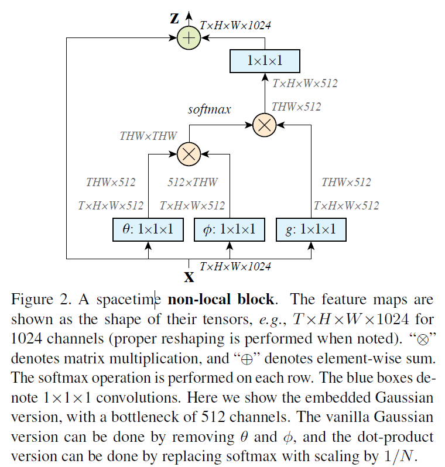

#### [Non-local Neural Networks](https://arxiv.org/abs/1711.07971)

##### 概述

​    本文主要将传统的non-local思路与现今十分流行的深度学习算法相结合的，构造了一种变种的卷积网络结构，可以十分方便的增加到现有的神经网络中，提升网络对于时间域、空间域的编码能力，增强网络性能，通过作者的实验，增加on-local结构后对于目标检测与行为分类均有很好的性能提升。

##### non-local 

​    non-local可以表述为：在输出中，位置$X_i$ 的特征可以表述为输入所有位置的加权和。根据这个思想作者定义了一个深度学习下广义的non-local操作：
$$
y_i=\frac{1}{c(x)}\sum_{\forall j} f(x_i,x_j)g(x_j)
$$

​    其中$y$ 与$x$ 分别表示输出与输入信号，其中小标$i$ 表征输出的位置，为待计算量，小标$j$ 表示输入信号中的需要加权的位置，函数$g(\cdot)$ 表示输入信号在某个特定位置的特征表述，$f(\cdot)$ 表述位置间的相对关系，可以理解为加权和的权值计算函数。

作者文中提到的non-local结构如下所示：

​    

​    **文章中提出的non-local能够对输入信号的所有位置进行加权，这是non-local区别于传统的CNN、RNN的地方，CNN虽然也能看做是对于输入信号的加权输出，但是CNN只是利用了卷积核所能够到的位置，只是局部的加权，non-local可以看做是一个和输入尺寸一样大的卷积核被作用到了输入信号上，大大增加了网络的感受野。能很好的增强网络对于特征的表征能力，提升整体性能。**

​    同时，在行为识别的任务中，作者介绍了关于I3D结构的信息，这种结构和P-3D结构十分类似，在行为识别这一类需要对序列信号建模的任务中有很好的启示作用。这样构建基础特征提取网络的过程简单易于实现。