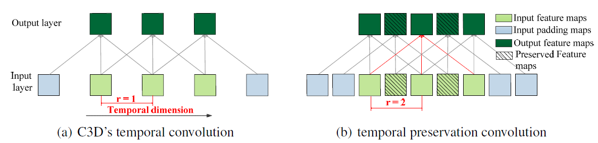

####TPC阅读笔记

###### 总述

​	temporal preservation network**(TPC)**, 是基于**CDC**网络的改进，相对于**CDC**网络**TPC** 网络能更好的保留时间轴上的信息，使得action detection更加的准确。

###### 网络结构

​	与CDC网络一样，TPC网络也是在C3D的网络基础上进行构建，毕竟在行为这个task上，严重缺乏3D预训练模型。TPC的提出主要是即想利用C3D这个模型，同时又改进CDC网络先下采样再上采样提升时间轴信息存在问题，而产生的折中之作。

​	相对于CDC网络只是在C3D最后三层加上CDC结构，将时间轴上的信息提升为和输入长度一样，TPC采用空洞卷积加pad的方案，让数据在网络中forward的过程中，时间轴上的长度始终保持一样，有效的避免了采样降维带来的信息丢失问题。

​	<u>相对于CDC网路，TPC最大的优势是实现简单，在mxnet中有对应的卷积可以利用，不需要单独实现层。同时TPC与CDC这样的逐层放开训练机制可以借鉴(经过验证在2D网络上finetune时，这样的机制有助于提升网络性能)。</u>